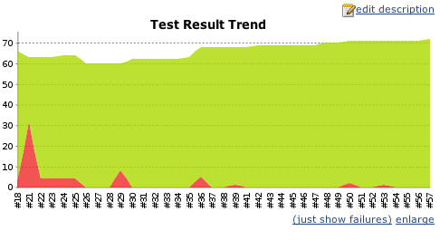

!SLIDE bullets
# Building a Django Project #

* Activate a virtualenv
* Install requirements
* Symlink test settings (e.g. sqlite database override)
* Migrations
* Run django-jenkins

!SLIDE smaller
## A Jenkins Build Script for a Django Project ##
    @@@ Bash
    #!/bin/bash -ex
    cd $WORKSPACE
    virtualenv -q ve
    source ./ve/bin/activate
    pip install -E ./ve -r requirements.txt
    pip install -E ./ve -r requirements-testing.txt
    cd $WORKSPACE/projectname
    ln -fs `pwd`/conf/testsettings.py `pwd`/localsettings.py
    python manage.py migrate
    python manage.py jenkins

!SLIDE bullets
# Automate builds with hooks #

## The most basic hook ##
    @@@ Bash
    wget http://jenkins/job/myproj/build?delay=0sec
            >/dev/null 2>/dev/null

# More ideas: #

* Dynamically create jobs
* Run jobs for specific branch
* Return feedback in console 

!SLIDE smaller
# Useful data and visualizations all over #

