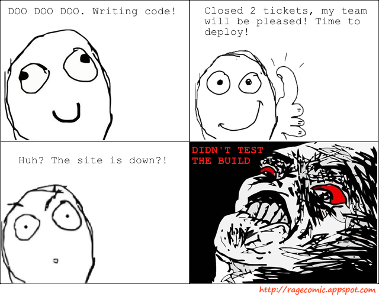

!SLIDE 
# Continuous Integration with <s>Hudson</s> Jenkins #

!SLIDE bullets center
# What? #

* http://jenkins-ci.org/ 
* automated building and testing of your code
* continous quality control
* Other software: Buildbot, Apache Gump, etc.

!SLIDE bullets
# Why? #

* promote test driven development
* reduce surprises, find bugs quick
* frequent deployment

!SLIDE center

