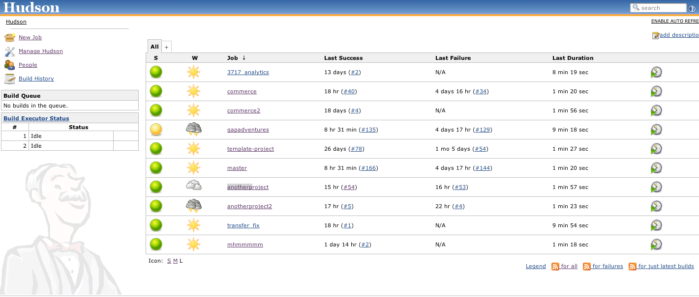
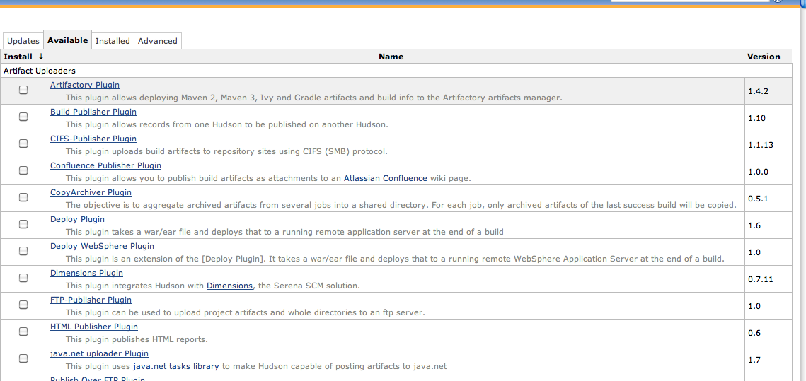

!SLIDE
# Jenkins is easy to start using #

    @@@ Ruby
    wget http://mirrors.jenkins-ci.org/war/
                latest/jenkins.war
    java -jar jenkins.war

## It's also on apt and other distro package managers ##

!SLIDE
# Easy to use web interface #

!SLIDE center
# Plugins, Plugins, Plugins! #

!SLIDE bullets
# Running your first build #

* Create a new job
* Connect to your repository
* Add build instructions (steps)
* Build
* ???
* Profit

!SLIDE center
# Demo Break! #
## 5 Minutes, I promise ##

Oh man, please don't break.
